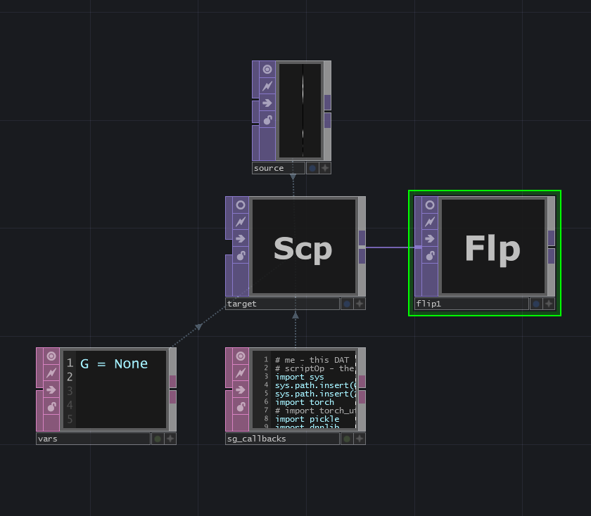

# Machine Learning Real-time

For the goal of this project, I needed to run and manipulate the trained neural nets in real-time. While I could have accomplished this with Python and windowing libraries, I decided to use [Touch Designer](https://derivative.ca) (TD). What TD gained me was a graphical interface, faster iterations, and lots of built-in capabilities for audio, video, images, networking, etc. TD also has python as a scripting language making the integration of machine learning significantly easier. Regarding hardware, my only option was a Windows operating system with the best Nvidia graphics card I could afford.

## Setting up in Touch Designer

This presumes some basic knowledge of Touch Designer. The file can be found at [./TouchDesigner/styleGAN_basic.toe](./TouchDesigner/styleGAN_basic.toe). 



The purple _source_ node is a [NoiseTop](https://docs.derivative.ca/Noise_TOP). This noise image is used as the input vector for the Stylegan network. Stylegan 3 is expecting a 1D array of length 512 with floating point values ranging from -1 to 1. On the _source_ node, I chose Simplex 2D GPU for the type of noise. Default values for noise are 0 to 1. I set .9 for Amplitude, 0 for Offset to create roughly a -1 to 1 value range and checked on monochrome. On the Transform tab the script "me.time.seconds * .1" was added to the translate x property, so that we're constantly updating the noise values. On the Common tab, I set the resolution to 1x512, Output Aspect to Resolution, and Pixel Format to 32-bit Float (Mono).

The _target_ node is a [ScriptTOP](https://docs.derivative.ca/Script_TOP)-an image/texture operator. This automatically creates a script node that I've renamed to _sg\_callbacks_. I've made an additional script from a [TextDat](https://docs.derivative.ca/Text_DAT) named _vars_ and a [FlipTop](https://docs.derivative.ca/Flip_TOP) node. Discussing in reverse order, the flip top gives options for horizontally and/or vertically flipping the image. My _vars_ node contains only the text "G = None." I use this node to set variables separately from my _sg\_callbacks_, so I can edit _sg\_callbacks_ and see the updates more quickly. Otherwise, I would need to reload my NN for each update. The magic happens in _sg\_callbacks_. The file for this is [./TouchDesigner/scripts/styleGan.py](./TouchDesigner/scripts/styleGan.py). 

Looking at the script, I added lines 3-21. The sys.path.insert and sys.path.append will need to have their parameters adjusted based on computer and user inputs individually. In lines 27-31, I handle the UI button toggle, open the NN specified in the UI field, load the NN into GPU memory, and ask it only to evaluate. The last part on lines 36-65 handled every frame, meaning it should be as efficient as possible. First, I check to see if the NN is loaded. If yes, then ask that we don't run any gradient descent calculation. This gains us a little speed. Copy the _source_, noise image into CUDA memory, make a pointer, and wrap it up as a tensor. Line 48 is where we push that noise image into the NN and receive the output. On lines 50-55 the image is converted back into 8bit RGB color space and sliced away from extraneous arrays. Lines 56-58 I glued on an alpha channel so that Touch Designer doesn't complain. Finally, lines 60-65 build a properties object and copy the image into the _target_'s image buffer. 

By default, the NN is not loaded. Add a path to the NN file you want to load on the target node's parameters, then click the load button. Again, you must have the entire toolchain installed and set up correctly. In addition, you must have an Nvidia graphics card. Several command windows will pop up and disappear. This is the Just In Time (JIT) process by ninja to compile the CUDA kernels. Even if cached, it will still try to do this. 

## Synthesis Layers

Use [./TouchDesigner/styleGAN_basic.toe](./TouchDesigner/styleGAN_basic.toe) for this example.

To pull and look at individual synthesis layers, change the script on the _sg\_callbacks_ node to [./TouchDesigner/scripts/styleGan_synthesis_layer.py](./TouchDesigner/scripts/styleGan_synthesis_layer.py). This script replaces line 48 with 5 new lines of code. This loop goes step by step through the layers of the NN until we have the one we want, then stops and returns an image. An interesting note here is that depending on which layer is selected, the image returned will have different dimensions from 1024 pixels square down to 16 pixels square.

Opening, editing, and saving the script will allow on-the-fly changes. If, for example, on line 50, we would like to see layer 14 instead of layer 6. We change 'L6' to 'L14' and save - that's it.

To see which layers are in the synthesis stack, check [./ML_Layers/Stylegan3_synthesis_layers.py](./ML_Layers/Stylegan3_synthesis_layers.py). These synthesis layers are groups of tensor layers that comprise StyleGan 3.

## Modifying a Layer

To modify a tensor layer, first, we need to know if we loaded a StyleGan 2 or StyleGan 3 network. For StyleGan 2 see [./ML_Layers/Stylegan2_layers.py](./ML_Layers/Stylegan2_layers.py). For StyleGan 3 see [./ML_Layers/Stylegan3_layers.py](./ML_Layers/Stylegan3_layers.py). Open the TouchDesigner example, [./TouchDesigner/styleGAN_edit_layer.toe](./TouchDesigner/styleGAN_edit_layer.toe) 

There are two script changes in this example. The first change is within the _vars_ node. I added three variables. A "G2" to hold a second copy of the NN and then two state dict variables. These extra variables make it such that edits to a layer are salvageable later. For example, I can never get the original values back if a tensor layer is set entirely to zero. I use these extra variables as a reference to restore the original values when needed. Second, in _sg\_callbacks_ I added several more lines of code, found [here](./ML_Layers/Stylegan3_edit_layers.py). On 31-32 lines I load the NN a second time. Then, on lines 35-37 continue to initialize and store values. Jumping down to lines 78-79, I see a helper function. Returning to lines 54-55, is where I use that function and load the modified state dictionary into the NN. For this example, I chose a tensor layer that highly impacts on the output imagery. Changing the "1st" parameter larger or negative, saving the file, will show the changes immediately. Now, "1" or any number is static and modestly interesting, but lets pass in something like:

```python
edit_layer_by_name('synthesis.input.weight', math.sin(absTime.seconds))
```
This quickly becomes more visually dynamic and we can call the function many times on different layers, each with their own value or value generator.

## Blending two Neural Nets

This example demonstrates how to take two different NNs and blend, linearly interpolate (LERP), between the values. Open the TouchDesigner example, [./TouchDesigner/styleGAN_blend_layer.toe](./TouchDesigner/styleGAN_blend_layer.toe). 

Again, two script changes in this example. First in within the _vars_ node. I added "GHold" and "gsdHold" to hold a copy of the original values to LERP from. Second, in _sg\_callbacks_ I added several more lines of code, found [here](./ML_Layers/Stylegan3_edit_layers.py). Modified and added lines 30-35 to change where the duplicate copy is stored and to load the different NN. Lines 39 and 41 are just like before, initialize and store. At the bottom, on lines 80-87, I have a helper function that adjusts all the layers in a synthesis group. This will work for most of the synthesis layer groups, but not all. This can be changed, or additional helper functions can be added. Returning to line 58, I use the helper function and pass in the synthesis group name and amount to LERP. The LERP amount is not clamped or limited, meaning values larger than one and negative values will work and give interesting results.


