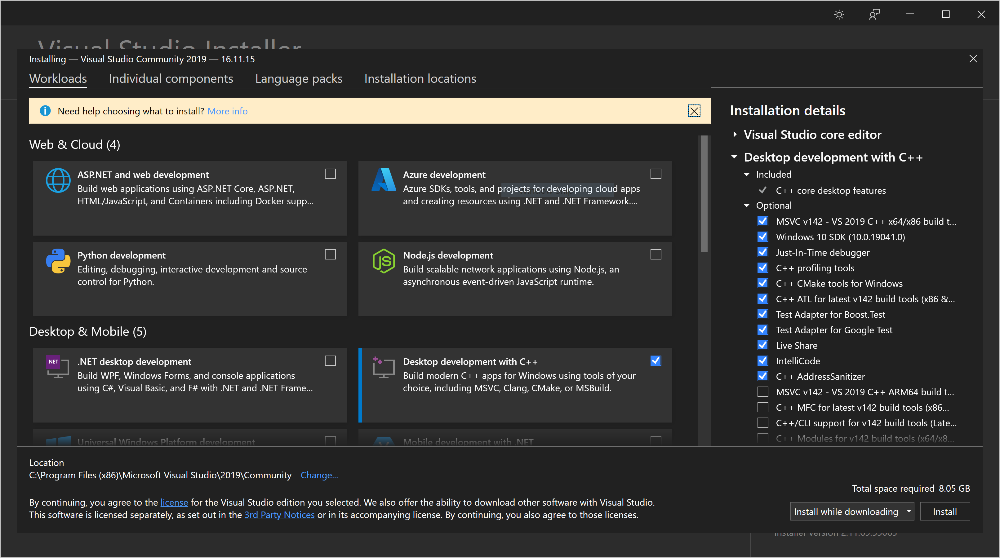
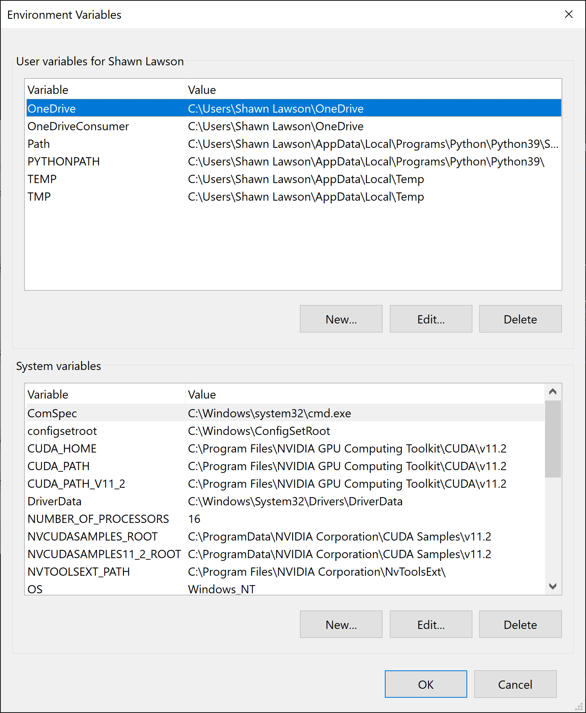
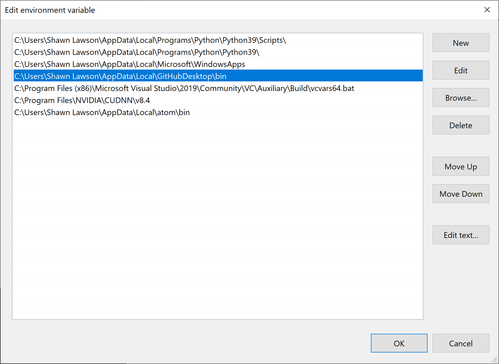
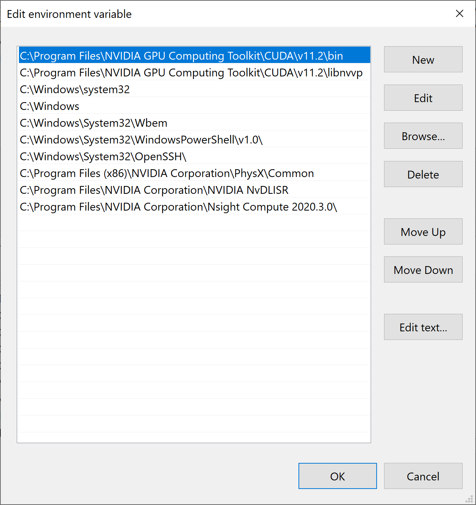

# Machine Learning Real-time

For the goal of this project, I needed to run and manipulate the trained neural nets in real-time. While I could have accomplished this with python and windowing libraries I decided to use [Touch Designer](https://derivative.ca) (TD). What TD gained me was a graphical interface, faster iterations, and lots of built-in capabilities for audio, video, images, networking, etc. TD also has python as a scripting language making the integration of machine learning significantly easier. With regards to hardware, my only option was a Windows operating system with the best Nvidia graphics card I could afford.

## Installation

Download Touch Designer from the link above and install it. Making an account is required, it's free. Then make an education/learning license, also free. Install the license in Touch Designer. That's the easy part. 

On the computer I was using, I needed to remove the preinstalled Nvidia Frameview and disable the graphics driver and PhysX. The graphics driver that shipped with the computer was not compatible with the CUDA and PyTorch tools I needed to use. I downgraded my driver to v471.41. Not all computers will need to do this. I downloaded and installed the 11.2 version of the [CUDA Toolkit](https://developer.nvidia.com/cuda-11.2.0-download-archive) for windows. This [guide](https://docs.nvidia.com/cuda/archive/11.2.0/cuda-installation-guide-microsoft-windows/index.html) is also quite helpful

I installed a 3.9 version of [python](https://www.python.org/downloads/release/python-3913/). Again I was not intending to have multiple installs, so I did not use MiniConda or Conda. Also, for real-time use in TD, I found it easier to have the system path variables point at a single python install. Then installed the [pip](https://pip.pypa.io/en/stable/installation/) package manager. Next up, the PyTorch libs and the GPU CUDA handles. I used windows powershell to access the command line, because the commands are unix based rather than dos based. I ran the below command or could be acquired from [here](https://pytorch.org/get-started/locally/).
```bash
> pip install torch==1.10.1+cu111 torchvision==0.11.2+cu111 torchaudio==0.10.1 -f https://download.pytorch.org/whl/torch_stable.html
```

Similarly to the linux install, I needed the gcc tools to compile some of the cuda files on demand. On windows, I installed [Visual Studio Community 2019](https://visualstudio.microsoft.com/vs/community/). Then, see image below, installed the _Desktop development with C++_ workload.



After this, system variables need to be created. To do that, I ran the bat file at this location.
```
C:\Program Files (x86)\Microsoft Visual Studio\2019\Community\VC\Auxiliary\Build\vcvarsall.bat
```

Back to python again. The _trick_ to getting access and live, real-time neural net manipulation was using the CuPy library. I followed the instructions [here](https://docs.cupy.dev/en/stable/install.html) for the version of CUDA I have installed. The two additional libraries I used were [cuTENSOR](https://developer.nvidia.com/cutensor) and [cuDNN](https://docs.nvidia.com/deeplearning/cudnn/install-guide/index.html). Both may require creating an Nvidia developer account.

Before getting much further, let's check our system paths and variables. In the first image, at the top, check the PYTHONPATH variable points to where python is installed. At the bottom, check CUDA_HOME, CUDA_PATH, and NVTOOLSEXT_PATH to point correctly.



Checking on the user _Path_ variable, see below. We look to be sure we have python, python/scripts, and vcvars64.bat. The CUDNN path is there if you installed that part.



Checking on the system _Path_ variable, see blow. We look to be sure we have CUDA/v11.2/bin, CUDA/v11.2/libvvp



Download the git repository for [Stylegan 3](https://github.com/NVlabs/stylegan3) in an easy place to access. Looking at the _environment.yml_ file from the stylegan 3 repository I ran this:
```
> pip install numpy click pillow scipy requests tqdm ninja matplotlib imageio
```
Then I ran pip install %whatever I'm missing% to fix things as errors came up.

## Test

We can run a test to make sure this all works. From inside the stylegan 3 repository we can run their gen_images script.
```bash
> python3 gen_images.py --outdir=out --trunc=1 --seeds=2 --network=https://api.ngc.nvidia.com/v2/models/nvidia/research/stylegan3/versions/1/files/stylegan3-r-afhqv2-512x512.pkl
```

## Changes to Stylegan 3

Because Touch Designer is running it's own copy of python; it does not know about everything we just installed to make stylegan 3 work. In this case, we simply need to tell stylegan where to find the expected libraries we just installed. To do this, we need to edit a file at stylegan3/torch\_utils/custom\_ops.py  I added the following lines of code at lines 109-111. Anyone else will need to modify these based on their installed location of python.
```python
include_i_flag = ['-IC:/Users/Shawn Lawson/AppData/Local/Programs/Python/Python39/include']
include_me = ['C:/Users/Shawn Lawson/AppData/Local/Programs/Python/Python39/include']
library_me = ['/LIBPATH:C:/Users/Shawn Lawson/AppData/Local/Programs/Python/Python39/libs']
if len(all_source_dirs) == 1: # and ('TORCH_EXTENSIONS_DIR' in os.environ):
```

Now we need to add our extra paths into the cpp compiler. On line 139 we find the following. 

```python
torch.utils.cpp_extension.load(name=module_name, build_directory=cached_build_dir,
    verbose=verbose_build, sources=cached_sources, **build_kwargs)
```

I added in our three extra paths with the load function's built-in parameters to now look like this.

```python
torch.utils.cpp_extension.load(name=module_name, build_directory=cached_build_dir,
    verbose=verbose_build, sources=cached_sources, extra_cflags=include_i_flag, 
    extra_include_paths=include_me, extra_ldflags=library_me, **build_kwargs)
```

There are situations where this change to custom\_ops is not needed. Stylegan 3 is loading and _just in time_ (JIT) compiling CUDA kernels. You can see them in stylegan3/torch\_utils/ops. This is what visual studio and the python ninja libraries are for. Sometimes, not all the time, running stylegan 3 for training, generating images, or visualizing will create a CUDA kernel cache. Touch Designer will continue to complain and toss errors, but may see these and continue to run. Editing the custom\_ops.py file will make it such that Touch Designer will do the JIT compiling correctly on its own.

## Setting up in Touch Designer

This presumes some basic knowledge of Touch Designer. I've made a Container node added some additional parameters and jumped inside. The green _par1_ node is automatically created. The purple _source_ node is a [NoiseTop](https://docs.derivative.ca/Noise_TOP). This noise image is used as the input vector for the Stylegan network. Stylegan 3 is expected a 1D array of length 512 with values ranging from -1 to 1. On our _source_ I chose Simplex 2D GPU for Type of noise. Default values for noise are 0 to 1. I set .9 for Amplitude, 0 for Offset to create roughly a -1 to 1 value range, and check on monochrome. On the common tab, I set resolution to 1x512, Output Aspect to Resolution, and Pixel Format to 32-bit Float (Mono).

The _target_ node is a [ScriptTOP](https://docs.derivative.ca/Script_TOP), which is basically an image/texture operator. This automatically creates a script node, that I've renamed to _sg\_callbacks_. I've made an additional script from a [TextDat](https://docs.derivative.ca/Text_DAT) named _vars_, a [FlipTop](https://docs.derivative.ca/Flip_TOP) node, and [OutTop](https://docs.derivative.ca/Out_TOP) node. Discussing in reverse order, OutTop sends the image out of this container node. Flip top gives options for horizontally and/or vertically flipping the image. My _vars_ node contains only the text "G = None." I use this node to set variables separately from my _sg\_callbacks_, so that I can edit _sg\_callbacks_ and see the updates more quickly. Otherwise I would need to reload my NN for each update. The magic happens in _sg\_callbacks_. The file for this is [./TouchDesigner/scripts/stylegan.py](./TouchDesigner/scripts/stylegan.py). 

Looking at the script, I added lines 3-21. The sys.path.insert and sys.path.append will need to have there parameters adjusted based on computer and user individually. In lines 27-31, I handle the UI button toggle, open the NN specified in the UI field, load the NN into GPU memory, and ask it to only evaluate - not train. The last part on lines 36-65 are handled every frame, meaning as efficient as possible. First I check to see if the NN is loaded. If yes, then ask that we don't run any gradient descent calculation, this gains us a little speed. Copy the _source_, noise image into CUDA memory, make a pointer, and wrap it up as a tensor. Line 48 is where we push that noise image into the NN and receive the output. On lines 50-55 The image is converted back into 8bit RGB color space and sliced away from extraneous arrays. Lines 56-58 we glue on an alpha channel so that Touch Designer doesn't complain. Finally lines 60-65 build a properties object and copy the image into the _target_'s image buffer. 
