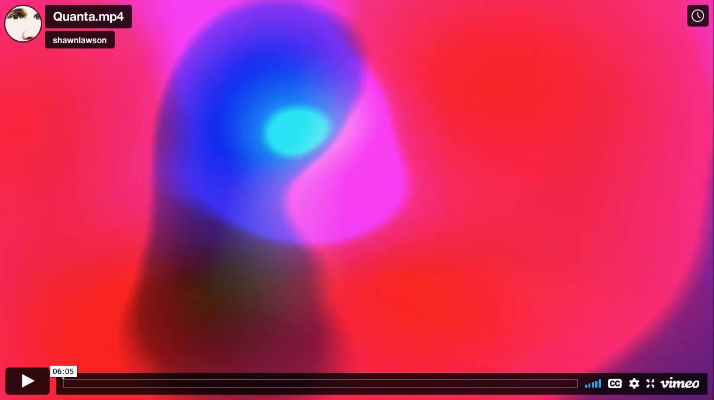

# XAI-Visual-Guts
 
This repository archives the artistic research results from the production grant Leonardo Rebooted: [https://quoartis.org/project/leonardo-rebooted/](https://quoartis.org/project/leonardo-rebooted/); within the category of Artificial Intelligence and Quantum Computing. Funded by Da Vinci Labs [https://www.davincilabs.eu](https://www.davincilabs.eu)

For details:  
- Setting up for machine learning and training - [ML_Training](./ML_Training.md)
- Data set information - [ML_Datasets](./ML_Datasets.md)
- Setting up for real-time machine learning  - [ML_Realtime_Setup](./ML_Realtime_Setup.md)
- How to use real-time machine learning  - [ML_Realtime](./ML_Realtime.md)
- Thoughts - [ML_PostMortem](./ML_PostMortem.md)

# Pitch

## Abstract
Artificial Intelligence and Machine Learning (AIML) are rapidly changing nearly every aspect of post-modern life; but, do we really understand it? Quantum Computing will only accelerate the adoption of AIML as the new algorithm(s) for universal computability emerge. Explainable AI (XAI) is a burgeoning field of research with the goal of opening the AIML black box and explaining how it works. From the technical standpoint, this is typically calculating and demonstrating input-to-output connections with the hope of generating more trust in AIML. The intent of this proposal is to create and reveal the inner workings of an AIML from a visual arts standpoint - visual arts XAI.

## Concept
Create a short audiovisual video/animation from AIML trained by the artist that self-exposes latent space navigation and neural net layer interaction. Ideally, the final AIML agent(s) will be fully autonomous - meaning that audiovisuals could be generated by the AIML agent infinitely. Additionally, the artist will publish/open source any code, discoveries, and how-to instructions on GitHub. Philosophical musings and written products may occur and are primarily framed within Flusser's concept of the Technical Image.

# Updates

## First update

This video was a proof of concept with some data capture, NN training, and loading the NN into Touch Designer. Then, it shows how to select and use synthesis layers in real time.

## Second update

This video demonstrates how to load up multiple NNs and linearly interpolate (LERP) or blend-specific tensor layer(s) between two different NNs. This led to entirely swapping out the layer of one NN with the equivalent layer of the second NN. This video starts with a couple of seconds of one NN, then a couple of seconds of the second NN. The remainder of the video shows various treatments when LERPing tensor layers.

## Third update

This video shows five different people, vertically, at various degrees of completed NN training, and horizontally, with the final image, input, L14, L10, L6, and L0 synthesis layers, all with the exact same NN input data.

## Final update

Animations were created and sent to the musicians. They made several recordings in a live cinema method - improvisational performance with projected video. The recordings were then analyzed and used to manipulate parameters of the NN input generators. Several visual recordings were made and edited together with titles and the recorded audio.

# Credits

Violist - [Chris Fisher-Lochhead](http://cflmusic.com)

Electronic Instrument System (EIS) - [Michael Century](http://nextcentury.ca)

Audio Engineer - [Ross Rice](https://feistyfishrr.wixsite.com/rossarice)

EIS - Expanded Instrument System, with the Permission of The Pauline Oliveros Trust and The Ministry of Maat. [https://www.ministryofmaat.org](https://www.ministryofmaat.org)

Data Set Wrangler - [Jeremy Stewart](https://blindelephants.co)

Storytellers  -  Haley Day, Mike Esperanza, Olivia Link, Kendall Niblett, and Nia Sadler

Machine Learning Hardware Support - [Research Computing, Arizona State University](https://cores.research.asu.edu/research-computing/about)

Sound Recording Facilities - [Experimental Media & Performing Arts Center, Rensselaer Polytechnic Institute](https://empac.rpi.edu)
