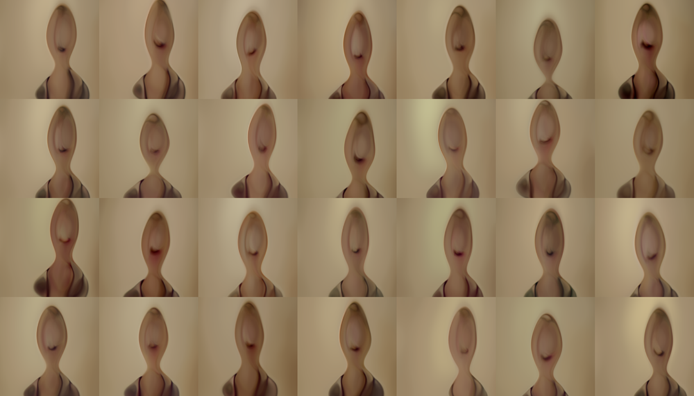

# Data Set 1

This first image is how stylegan 3 is initialized with random data.

The next four images are pulled sampled during the training. These are not taken at regular intervals.

This is the an image of the expected or real images that stylegan should produce.

