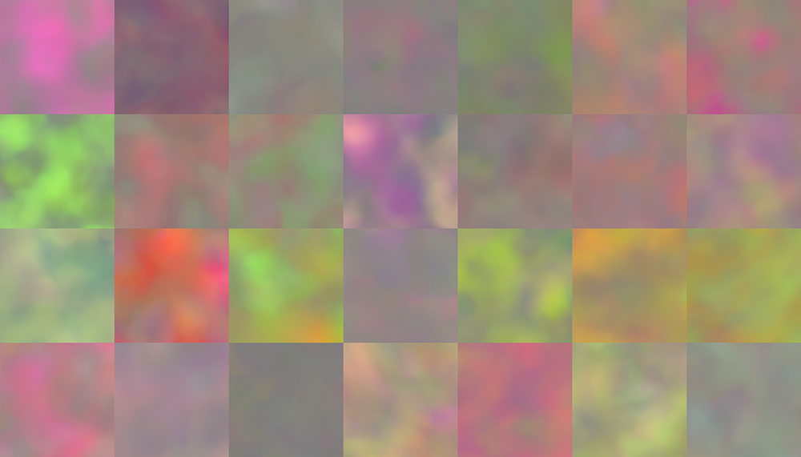
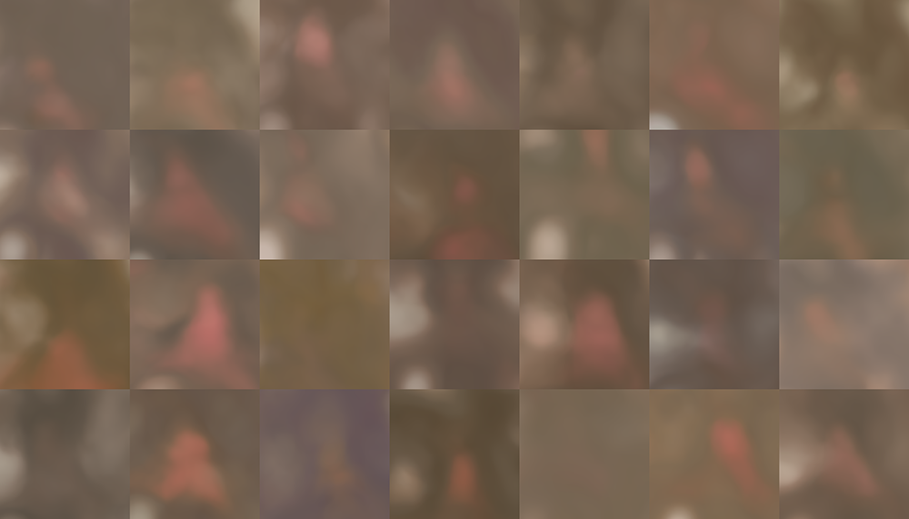
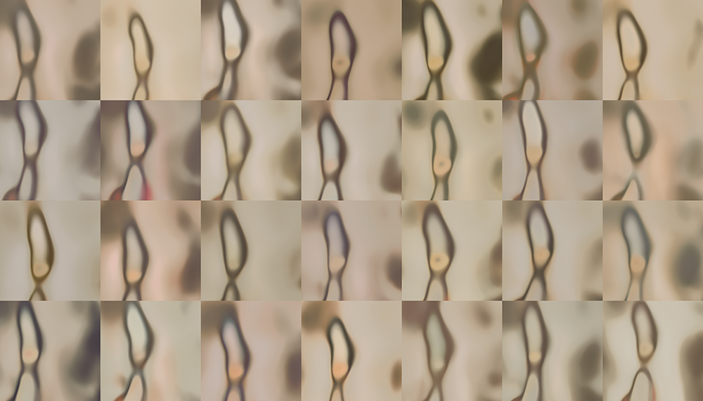
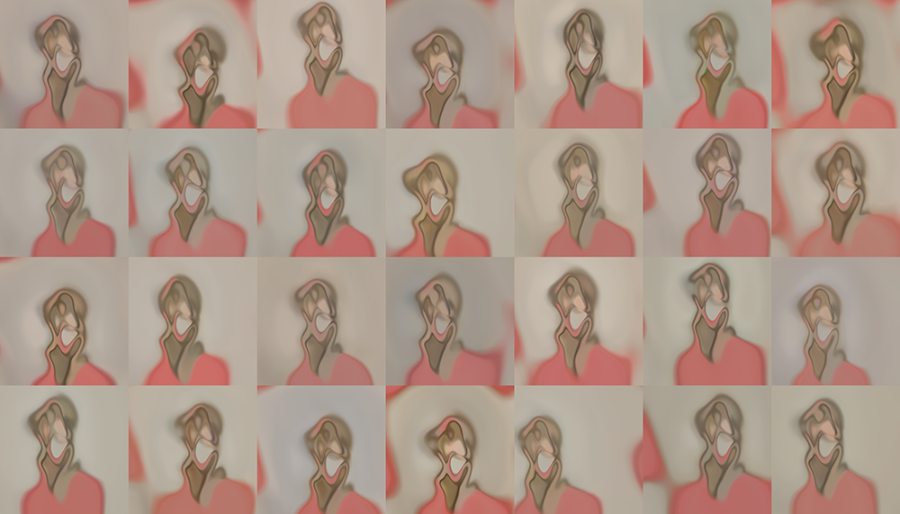
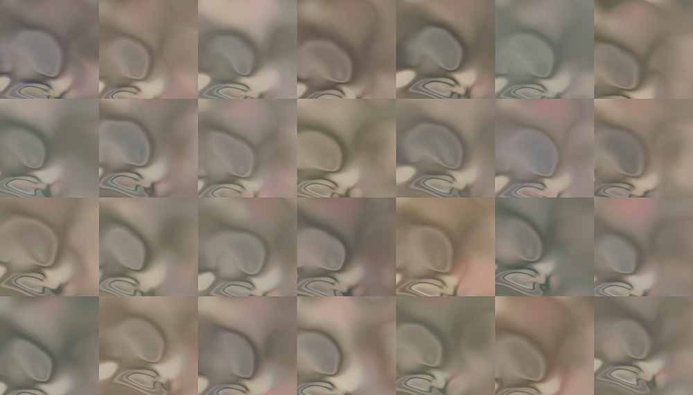
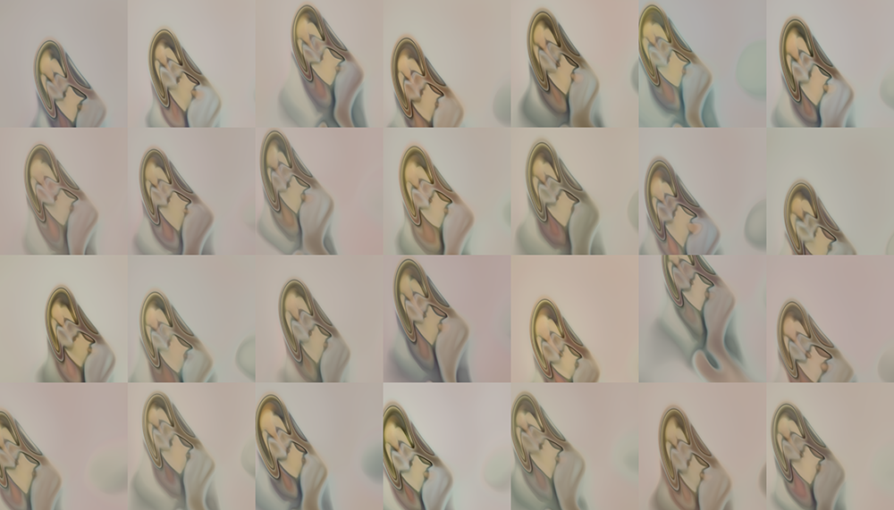
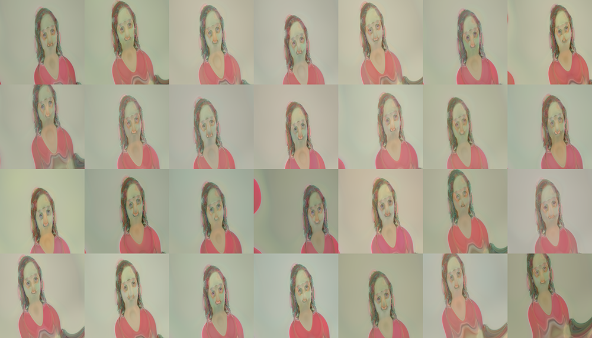
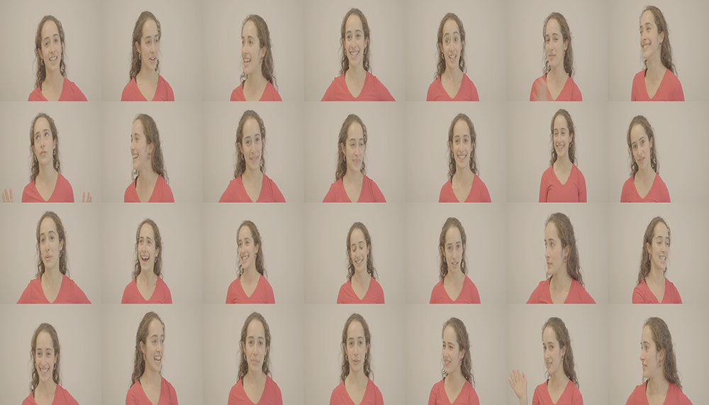

# Data Set 3

This first image is how stylegan 3 is initialized with random data.

The next six images are pulled and sampled during the training. These are not taken at regular intervals.

This is an image of the expected or real images that stylegan should produce.

